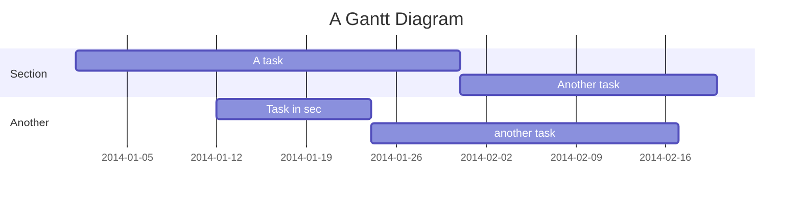

+++
title = 'Hugo GitHub Issue #9571'
date = 2022-02-25T12:14:31-08:00
draft = false
details = 'https://github.com/gohugoio/hugo/issues/9571'
description = "Improve attribute vs options in new code blocks setup"
+++

```kroki-mermaid {.my-diagram-class #my-diagram-id style="margin: 1rem;"}
gantt
  title A Gantt Diagram
  dateFormat  YYYY-MM-DD
  section Section
  A task           :a1, 2014-01-01, 30d
  Another task     :after a1, 20d
  section Another
  Task in sec      :2014-01-12, 12d
  another task     :24d
```

```bash {.my-code-class #my-code-id style="dracula" linenos="table"}
declare $a=1
if [[ "$a" eq 1 ]];then
  echo "$a"
fi
```


